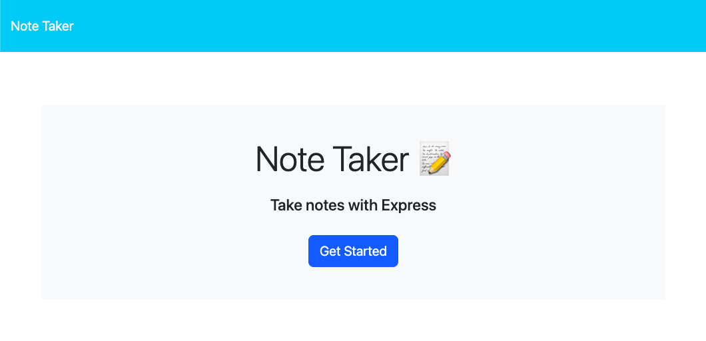

# Note Taker Starter Code

## Description

This is an application created to showcase the use of Express.js to take and store notes.

## Table of Contents
- [Screenshot of Application](#screenshot-of-application)
- [Installation Instructions](#installation-instructions)
- [Usage Information](#usage-information)
- [Contribution Guidelines](#contribution-guidelines)
- [Test Instructions](#test-instructions)
- [License](#license)
- [Questions](#questions)

## Screenshot of Application

## Installation Instructions
In order to deploy the application, go to the terminal and enter "npm install” and "npm install express --save". Once that has been installed, go to the deployed application in Heroku to begin.

## Usage Information
To use the application, you will need to enter your own notes and you will have the option to save the note or clear the form. Once the note is saved, it will populate in the left-hand column. You will then have the option to delete the note once complete using the DELETE /api/notes/:id option in Insomnia. 

## Contribution Guidelines
This project contains a clone of the original repository miniature-eureka (https://github.com/coding-boot-camp/miniature-eureka). This was previously cloned into my own repository and edited in order to complete a challenge illustrating the use of Express.js.

## Test Instructions
Enter a note and save it to have it populate in the left-hand column. To view an existing note, simply click on the note in the column and the title and text will populate back on the screen.

## License
This project is licensed under the MIT License.

## Questions
For further questions, please reach out to me:
- GitHub: [NemiMoser](https://github.com/NemiMoser)
- Email: nohemi.moser@gmail.com
